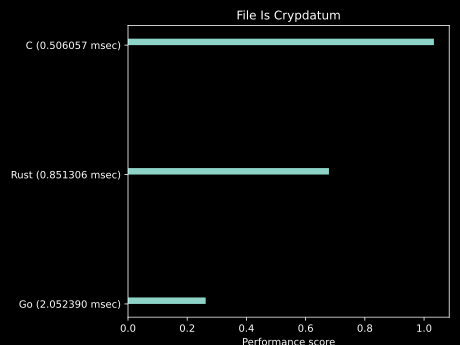
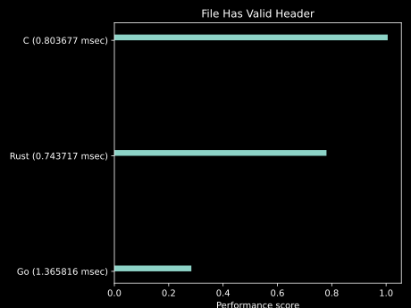
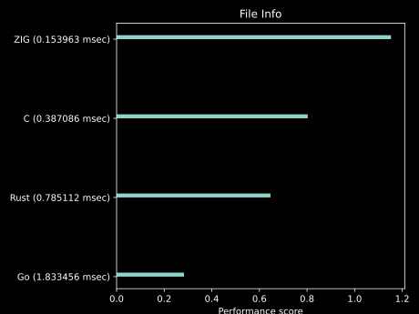

<h1><b>Cryptdatum Data Format v1</b></h1>
<h2>Public Working Draft</h2>

---

**Authors:**

*[Marko Kungla](https://github.com/mkungla)*

|              |              |
| ------------ | ------------ |
| **Date:**    | *10.05.2022* |
| **Updated:** | *27.01.2023* |
| **Version:** | *0.4.17* |

<h2>Table Of Contents</h2>


- [Introduction](#introduction)
- [Cryptdatum Data Format Specification](#cryptdatum-data-format-specification)
  - [Design](#design)
  - [Cryptdatum Header Format](#cryptdatum-header-format)
    - [Header Structure](#header-structure)
    - [Header validation](#header-validation)
  - [Metadata](#metadata)
    - [Payload](#payload)
    - [Byte Ordering](#byte-ordering)
    - [Constants](#constants)
    - [Enums](#enums)
  - [Checksum](#checksum)
  - [Compression](#compression)
  - [Encryption](#encryption)
  - [Data Signing](#data-signing)
  - [File extension](#file-extension)
  - [Error Handling](#error-handling)
- [Examples and Use Cases](#examples-and-use-cases)
- [Implementation Benchmarks](#implementation-benchmarks)


## Introduction

The Cryptdatum format is a powerful, flexible universal data format for storing data in a long-term compatible way across domains and with any encryption and compression algorithms. It consists of a 64-byte header that stores information about the data payload, followed by the data payload or 64-byte header followed by the metadata, signature, and then data payload. Cryptdatum is designed to be flexible enough to accommodate a variety of use cases, while still maintaining simplicity. All features used in the data can be determined from different header flags. e.g.

- If Metadata type flag is set then the value can be used by decoder to determine how to parse metadata from the beginning of the payload.
- If ChunkSize is greater than 0 then data can be streamed and processed in chunks
- if Compression flag is set then it represent Compression Algorithm used so that decoder can decide how to decompress the data.
- If Encryption flag is set then it represent Encryption Algorithm used so that decoder can decide how to decrypt the data.

Cryptdatum can be used to store and transmit data fast. The format includes a number of features to ensure the security and integrity of the data, including built-in checksumming, optional encryption, compression, signing, and metadatum API's.


## Cryptdatum Data Format Specification

The key words “MUST”, “MUST NOT”, “REQUIRED”, “SHALL”, “SHALL NOT”, “SHOULD”, “SHOULD NOT”, “RECOMMENDED”, “MAY”, and “OPTIONAL” in this document are to be interpreted as described in <a href="https://www.rfc-editor.org/rfc/rfc2119" title="Key words for use in RFCs to Indicate Requirement Levels">link-RFC-2119</a>.

### Design

The Cryptdatum (CDT) format consists of a 64-byte header followed by the payload. The header contains metadata about the data, including a magic number, version number, timestamp, operation counter, checksum, flags, total size of datum, compression algorithm (if used), encryption algorithm (if data is encrypted), signature size field (if data is signed), and metadata type (if metadata is present).

The structure of a valid Cryptdatum is as follows:

```
<valid cryptdatum> ::= <cryptdatum header>
  | <cryptdatum header> <cryptdatum metadata> 
  | <cryptdatum header> <cryptdatum metadata> <signature> <payload>
  | <cryptdatum header> <signature> <payload>
  | <cryptdatum header> <payload>
```

The payload, signature and metadata are stored after the header. The structure of the data after the header will depend on the flags and algorithm fields in the header.


### Cryptdatum Header Format

The Cryptdatum header is a 64-byte block of data that contains metadata about the data payload. It is used to identify the data as a Cryptdatum datum, as well as to indicate the features that are used by the datum.

- **The magic number** is a 4-byte value 0xA7, 0xF6, 0xE5, 0xD4 that identifies the header as a Cryptdatum header. It helps to prevent the header from being mistaken for data belonging to another format.
- **The version number** is a 2-byte value that indicates the version of the Cryptdatum format used to encode the data. This allows the format to evolve over time without breaking backwards compatibility.
- **The flags** are an 8 byte flag bits value that can be used to indicate whether the data is encrypted, compressed, or has other supported features enabled. Other flags may be added in the future. See [Enums](#enums) for defined flag bit values.
- **The timestamp** is an 8-byte value that contains a Unix timestamp in nanoseconds, indicating the time when the data was created. It can be used to order data by creation time and to determine the age of the data.
- **The operation counter** is a 4-byte value that can be used to assign a unique operation ID to the data when multiple datums are created with the same timestamp. This helps to ensure that each datum has a unique identifier, even when the timestamps are the same. It can be used to differentiate between multiple operations that produced that datum and were executed in parallel. When used, the flag bits (*16*) MUST be set, and the minimum value of the operation counter field is then an unsigned integer 1.
- **The Chunk size field** when set indicates that payload can be processed in chunks by (size) rather than at once. This is useful when the Cryptatum data container holds very large data which is hard to process at once, and enables data processors to delegate encoding or decoding in parallel. The same applies to compression and encryption. When data is chunked, the flag bit (*512*) MUST be set.
- **The Network ID** is an unsigned 32-bit integer which can be used between networks to identify the source network of the payload. While the specification does not specify the usage of this field strictly, it is possible that there can be a decentralized or centralized registry for network IDs. This, however, will not prevent anyone from using their own Network ID registry on their own networks. Some sort of shared registry is just a recommendation to use in public.
- **The size field** is an 8-byte value that contains the total size of the data, including the header. This helps to ensure that the entire data payload has been received. It allows the decoder to know how much data to read in order to fully decode the Cryptdatum, e.g. when the datum is not chunked.
- **The checksum** is an 8-byte value that contains a CRC64 checksum, which is used to verify the integrity of the data. If the checksum does not match the data, it is likely that the data has been corrupted or tampered with. When the Cryptdatum is chunked, then the CRC64 checksum value for each chunk is the first 8 bytes of the chunk and the Checksum header field is the checksum of header fields and chunk checksums. When used then flag bits (*8*) MUST be set. Implementations SHOULD enforce using checksums. However implementations SHOULD NOT treat it as erro when checksum is not used. There MAY be use cases where omitting checksum generation is totally valid.
- **The compression flag** is a 2-byte value that indicates which compression algorithm was used, if any. When used then flag bits (*32*) MUST be also be set to indicate that data is compressed. Currently, only the LZW, gzip and bzip2 algorithms are currently supported, but many more will be added in the future. See Compression section of this specification for more info.
- **The encryption flag** is a 2-byte value that indicates which encryption algorithm was used, if any. When used then flag bits (*64*) MUST be also set to indicate that data is encrypted. Currently, the Cryptdatum format supports the XChaCha20-Poly1305 encryption algorithm, but the format is designed to be flexible enough to accommodate other algorithms in the future. See Encryption section of this specification for more info.
- **The signature type**  flag is a 2-byte value that indicates what mechanism was used for signing the datum if it is signed. When used then flag bits (*256*) MUST be also set to indicate that data is encrypted.
- **The Signature Size** field is an 2-byte value that contains the total size of the signature after header for faster lookup of signature data and start location of the payload. Value of this field depends on signature type field and therefore may not be set for some signing methods. Such case format would be in follwoing order.

```
<valid cryptdatum> ::= <cryptdatum header> <cryptdatum metadata> <signature> <payload>
  | <cryptdatum header> <signature> <payload>
```

- **Metadatum type** 4-byte value which indentifies metadat format used if any. When used then flag bits (*1024*) MUST be also set to indicate that Metadata is in used. When used format would be in follwoing order.

```
<valid cryptdatum> ::= <cryptdatum header> <cryptdatum metadata>
  | <cryptdatum header> <cryptdatum metadata> <signature> <payload>
  | <cryptdatum header> <cryptdatum metadata> <payload>
```

- **The delimiter** is an 2-byte value `0xA6, 0xE5` that marks the end of the header. It helps to prevent the header from being misinterpreted as part of the data payload. It is also used to ensure that the header is properly parsed by the decoder.


#### Header Structure

The Cryptdatum header consists of the following fields:

| Field                 | Value Type                | Size (bytes) | Description |
| --------------------- | ------------------------- | ------------ |  ---------- |
| Magic                 | byte array                | 4            | format magic |
| Version               | unsigned integer (uint16) | 2            | format version |
| Flags                 | unsigned integer (uint64) | 8            | enabled features |
| Timestamp             | unsigned integer (uint64) | 8            | unix timestamp in nanoseconds UTC |
| OPC                   | unsigned integer (uint32) | 4            | Operation Counter. |
| ChunkSize             | unsigned integer (uint32) | 2            | Operation Counter. |
| Network ID            | unsigned integer (uint32) | 4            | Network ID |
| Size                  | unsigned integer (uint64) | 8            | Total size of the data |
| Checksum              | unsigned integer (uint64) | 8            | CRC64 checksum |
| Compression Algorithm | unsigned integer (uint16) | 2            | compression algorithm flag, if any |
| Encryption Algorithm  | unsigned integer (uint16) | 2            | encryption algorithm flag, if any |
| Signature Type        | unsigned integer (uint16) | 2            | signing algorithm |
| Signature Size        | unsigned integer (uint32) | 2            | signature size. |
| Metadata type         | unsigned integer (uint32) | 4            | meta data type |
| Metadata size         | unsigned integer (uint16) | 2            | size of the metadata |
| Delimiter             | byte array                | 2            | header delimter |

#### Header validation

*TBD*

- For default values, for reserved fields and padding `0x00` byte should be used. 
- Version Number MUST be less than or equal to the lates specification version. Implementations may limit the range of the version supported, which case concise and clear error should be returned to user indication that Cryptdatum version is out of supported range. 
- When validation of **Magic** or **Delimiter** validation fails, the simple unsupported format can error can be returned.
- All other cases when validation of other header fields fail the invalid Header Invalid error should be returned, optionally providing additional context what validation failed and portetially hinting user how to resolve that error.

### Metadata

*TBD*

Metadata provides limitless API to implement custom metadata or use one of the builtin metadata schemas, When data is encrypted and/or compressed metadata has no requirement and Metadata implementations may define different behaviours.

#### Payload

The payload is the data contained in Cryptdatum container, following the header. It can be of any length and can contain any type of data.

#### Byte Ordering

All multi-byte values in the Cryptdatum header are stored in little endian byte order. This means that the least significant byte (LSB) is stored at the lowest memory address, and the most significant byte (MSB) is stored at the highest memory address. That enables modern hardware, access to individual header bytes more efficiently. For rest of the data payload, metadata and signature data this requirement does not apply. 

#### Constants

 - **Version** for implementation of current version of Cryptdatum format should set that value to 1 as unsigned integer (uint16)   
 - **Magic Number** is fixed byte array `0xA7, 0xF6, 0xE5, 0xD4`
    if the Magic Number field is not recognized and matched at the beginning of the header, the header MUST be considered invalid.
 - **Delimiter** `0xA6, 0xE5`
    if the Delimiter field is not recognized and matched at the end (last 2 bytes) of the header, the header MUST be considered invalid.

#### Enums

 Following DatumFlags have been defined by current specification and can be applied to Flag header field; DatumFlags keep backward compability promise and future revisons may only append new DatumFlags while spesification MUST NOT modify exisiting ones such that it would break backward compability.

- **Flags** header field value can be set with one byte DatumFlag enums. DatumFlag is bitmask set of booleans represented by the bits in a single number.
	- **DatumInvalid (1)** When Cryptdatum format is correct, but payload data is considered invalid.
  - **DatumDraft (2)** This flag is set when datum is in draft state, therefore it's values can not be trusted.
  - **DatumEmpty (4)**: This flag indicates that Cryptdatum does not contain any payload.
  - **DatumChecksum (8)** Indicates that checksum is calculated and checksum value is avaliable in Checksum header field.
  - **DatumOPC (16)** Indicates that datum has operation counter value set in header (opc). 
  - **DatumCompressed (32)** Indicates that datum payload is compressed and algorithm used for compression can be looked up from Compression Algorithm header field which MUST be set when this flag bit is set.
  - **DatumEncrypted (64)** Indicates that datum payload is encrypted and algorithm used for encryption can be looked up from Encryption Algorithm header field which MUST be set when this flag bit is set.
  - **DatumExtractable (128)** When set is that indicates that payload can be processed externally. For example metadata when set may define how and where to extract the payload. This allows to offload post processing of the payload to other interpreters or accociated with the file extension. While such payload still can use Cryptdatum compression and encryption algorithms it provides extreamly high flexibility to offload also that to external program. E.g. Cryptdatum can hold as payload already compressed and encrypted data which case using Crypdatum compression and encryption algorithms would not make much sense, but you still may want to leverage Cryptdatum's signing and checksum features.
  - **DatumSigned (256)** Indicates that datum has been signed, That case Signature Type header field can be used to look up the signature type to decide how the signature can be verified. When Signature Size field is also set to value greater than 0 it will indicate that signature is included in datum and signature size length in bytes so that it can be extracted from between header and actual payload. 
  - **DatumChunked (512)** Indicates that datum payload chunked and streamable and can be decoded  from stream reasource when reciever has appropiate support for such decoder instead of processing all the payload at once. ChunkSize header field MUST indicate the size of the chunk when this bit is set.
  - **DatumMetadata (1024)** Arbitrary metadata, Cryptdatum does not care about the value of this field and allows higher level libraries to use it as they wich, however it is part of the checksumed data. Metadata size header field can be looked up to get size of the metadata.
  - **DatumCompromised (2048)** Indicates that source providing the datum has readons to belive that integrity of Cryptdatums payload can not be verified, e.g failed checksum check, invalid signature etc. Receiver should be extremely cautious when processing such Cryptdata payload. Meaning of this field very vague and interpretation may vary based on individual use-cases. Source providing such Cryptum may provide additional context why Datum Compromised flag has been set but that behaviour is not part of this specification and implementations may create custom behaviour around that Flag.
	

### Checksum

*TBD*

The checksum Header Field is an 8-byte value that is used to verify the integrity of the data. It is calculated using the CRC64 algorithm, which produces a unique checksum for a given data set.

The checksum is calculated by taking the following values as input:
If the data is signed, the signature is not used as part of the checksum calculation.

| Field                     | Description                       |
| ------------------------- | --------------------------------- |
| **Version**               | 2-byte value                      |
| **Flags**                 | 8-byte value.                     |
| **Timestamp**             | 8-byte value                      |
| **Operation Counter**     | 4-byte value                      |
| **Size**                  | 8-byte value                      |
| **Encryption Algorithm**  | 2-byte value                      |
| **Metadata type**         | 4-byte value                      |
| **Metadata size**         | 4-byte value                      |
| **Data Payload**          | Variable-length payload in datum. (including metadata) |


The CRC64 algorithm with ISO polynomial, defined in ISO 3309 and used in HDLC, is applied to these values to generate a 64-bit checksum value. This value is then stored in the checksum field of the header.

When the data is received, the checksum SHOULD be recalculated and compared to the value stored in the header. If the checksums do not match, it is likely that the data has been corrupted or tampered with.

The checksum can be used to detect errors in the transmission of the data, as well as to ensure that the data has not been modified by an unauthorized party. It is an important security measure that helps to ensure the integrity of the data.

When payload is encrypted and signed then signature data is omitted when calculating checksum. Header field Signature Size helps with to quickly idendify signature bytes and find a beginning of the payload.

Important to not that checksum is calculated over uncompressed payload data, this allows to change compression algorithm even after data is signed.

### Compression

*TBD*

Cryptdatum supports data compression to reduce the size of the data payload and improve transmission efficiency. Compression is optional and can be enabled or disabled using the DatumCompressed flag in the header.

The Cryptdatum uses most at the moment the LZW algorithm for data compression. The LZW algorithm is a lossless data compression algorithm that uses a dictionary to encode repeating patterns in the data. It is fast and efficient, making it well-suited for use in Cryptdatum current use-case.

To compress data with Cryptdatum, the data is first passed through the LZW compression algorithm, which produces a compressed representation of the data. The DatumCompressed flag is then set in the header, and the compressed data is stored in the payload.

To decompress data that has been compressed with Cryptdatum, the DatumCompressed and flag is checked in the header. If the flag is set, the data is passed through the LZW decompression algorithm to reconstruct the original data. If the flag is not set, the data is returned as-is, as it was not compressed.

### Encryption

*TBD*


### Data Signing

*TBD*

### File extension

The .cdt file extension is used to store data in the Cryptdatum (CDT) format.
A Cryptdatum file consists of a 64-byte header followed by rest of the data.

### Error Handling

*TBD*

## Examples and Use Cases

*TBD*

## Implementation Benchmarks

**Following Benchmarks contain performance metrics score which indicate better performance when the value is HIGHER. Score is calculated as standard deviation of the metric values and scaled to range 1-(0.1-1.0) relative to other languages**


- **`cpu-clock`**: This event measures the total amount of time that the program spent executing on the CPU.
- **`task-clock`**: This event measures the total amount of time that the program spent executing on the CPU, including time spent executing in the kernel on behalf of the program.
- **`cache-misses`**: This event measures the number of times that the program accessed memory that was not present in the cache. The cache is a high-speed memory that stores frequently accessed data, and a cache miss occurs when the program has to access main memory instead.
- **`branch-misses`**: This event measures the number of times that the program predicted the outcome of a branch instruction incorrectly and had to perform an extra jump to the correct location in the code.
- **`context-switches`**: This event measures the number of times that the program was suspended and another program was scheduled to run on the CPU.
- **`stability`**: Benchmarks are executed n times (e.g. 100). The Stablity reports total variance of these results and high score indicates that application was more stable compared to other languages.
- **`stability`**: Benchmarks are executed n times (e.g. 100). The Stablity reports total variance of these results and high score indicates that application was more stable compared to other languages.
- **`cpu-cycles`**: This counts the number of CPU cycles executed by the program.
- **`instructions`**: This counts the number of instructions executed by the program.

| | |
| --- | --- |
| ***Figure 1.** Performing minimal check to verify is external file containing Cryptdatum header* | ***Figure 2.** Performing minimal check to verify is external file containing valid Cryptdatum header* |
|  |  |
| ***Figure 3.** Print basic file info* | |
|  | |
