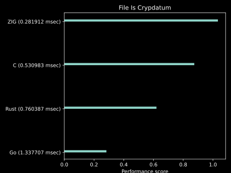
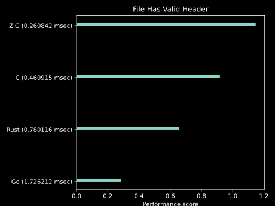
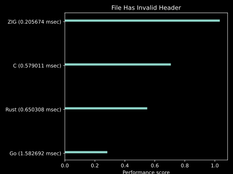
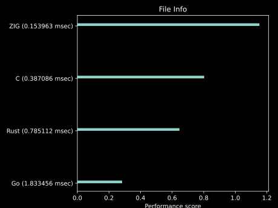

<h1><b>Cryptdatum Data Format Specification - Version 1.0.0</b></h1>
<h2>Public Working Draft</h2>

---

**Authors:**

*[Marko Kungla](https://github.com/mkungla)*

|                       |              |
| --------------------- | ------------ |
| **Date:**             | *10.05.2022* |
| **Updated:**          | *01.02.2023* |
| **Version:**          | *1*          |
| **Semantic Version:** | *0.5.0*      |

<h2>Table Of Contents</h2>


- [Introduction](#introduction)
- [Cryptdatum Data Format Specification](#cryptdatum-data-format-specification)
  - [Design](#design)
  - [Byte Ordering](#byte-ordering)
  - [Constants](#constants)
  - [Feature Flags](#feature-flags)
  - [Cryptdatum Header Format](#cryptdatum-header-format)
    - [Header Structure](#header-structure)
    - [Header Fields](#header-fields)
      - [MAGIC NUMBER](#magic-number)
      - [VERSION ID](#version-id)
      - [FLAGS](#flags)
      - [TIMESTAMP](#timestamp)
      - [OPERATION COUNTER](#operation-counter)
      - [CHUNK SIZE](#chunk-size)
      - [NETWORK ID](#network-id)
      - [SIZE](#size)
      - [CHECKSUM](#checksum)
      - [COMPRESSION ALGORITHM](#compression-algorithm)
      - [ENCRYPTION ALGORITHM](#encryption-algorithm)
      - [SIGNATURE TYPE](#signature-type)
      - [SIGNATURE SIZE](#signature-size)
      - [METADATA SPEC](#metadata-spec)
      - [METADATA SIZE](#metadata-size)
      - [DELIMITER](#delimiter)
  - [Metadata](#metadata)
  - [Payload](#payload)
  - [Checksum](#checksum-1)
  - [Compression](#compression)
  - [Encryption](#encryption)
  - [Data Signing](#data-signing)
  - [File extension](#file-extension)
  - [Error Handling](#error-handling)
  - [Specification Versioning](#specification-versioning)
  - [Cryptdatum Evolution](#cryptdatum-evolution)
- [Examples and Use Cases](#examples-and-use-cases)
- [Implementations](#implementations)
  - [API](#api)
  - [Libraries](#libraries)
- [Implementation Benchmarks](#implementation-benchmarks)


## Introduction

The Cryptdatum format is a powerful, flexible universal data format for storing data in a long-term compatible way across domains and with any encryption and compression algorithms. It consists of a 64-byte header that stores information about the data payload, followed by the data payload or 64-byte header followed by the optional metadata, signature, and then data payload. Cryptdatum is designed to be flexible enough to accommodate a variety of use cases, while still maintaining simplicity. Usage of all features used in the data can be determined by reading setting from different header flags and accompanying header fields. e.g. some of the following;

- If Metadata flag bit *DATUM METADATA (1024)* is set *METADATA SPEC* and *METADATA SIZE* field values can be used by decoder to determine how to parse metadata from the beginning of the payload.
- If *CHUNKK SIZE* field is greater than 0 and *DATUM CHUNKED (512)* flag bit is set then data can be streamed and processed in chunks
- if Compression flag bit *DATUM COMPRESSED (32)* is set then *COMPRESSION ALGORITHM* header field represents Compression Algorithm used so that decoder can decide how to decompress the data.
- If Encryption flag bit *DATUM ENCRYPTED (64)* is set then *ENCRYPTION ALGORITHM* header field represents Encryption Algorithm used so that decoder can decide how to decrypt the data.

Cryptdatum can be used to store and transmit data fast. The format includes a number of features to ensure the security and integrity of the data, including built-in checksumming, optional encryption, compression, signing, and metadatum API's.

Cryptatum is an ideal data format for both centralized and decentralized environments, as it is flexible enough to be used for simple, common local data container or as a means of data storage and transfer in distributed systems and even blockchain technologies. The 64 byte header and flexible metadata specification provide an API on steroids, and it's even suitable for use as a universal metaverse data container. Imagine being able to store and share all your virtual world assets and experiences in one, secure format accross all blockchain networks which have adopted this specification. The possibilities are endless.

## Cryptdatum Data Format Specification

The key words "MUST", "MUST NOT", "REQUIRED", "SHALL", "SHALL NOT", "SHOULD", "SHOULD NOT", "RECOMMENDED", "MAY", and "OPTIONAL" in this document are to be interpreted as described in <a href="https://www.rfc-editor.org/rfc/rfc2119" title="Key words for use in RFCs to Indicate Requirement Levels">RFC-2119</a>.

### Design

The Cryptdatum (CDT) format consists of a 64-byte header followed by the payload. The header contains information about the data and used Cryptdatum features, including a magic number, version number, timestamp, operation counter, checksum, flags, total size of datum, compression algorithm (if used), encryption algorithm (if data is encrypted), signature size field (if data is signed), and metadata type (if metadata is present).

The structure of a valid Cryptdatum is as follows:

```
<valid cryptdatum> ::= <cryptdatum header>
  | <cryptdatum header> <cryptdatum metadata> 
  | <cryptdatum header> <cryptdatum metadata> <signature> <payload>
  | <cryptdatum header> <signature> <payload>
  | <cryptdatum header> <payload>
```

The optional metadata, signature and payload are stored after the header. The structure of the data after the header will depend on the flags and feature field values in the header.

### Byte Ordering

All multi-byte values in the Cryptdatum header are stored in little endian byte order. This means that the least significant byte (LSB) is stored at the lowest memory address, and the most significant byte (MSB) is stored at the highest memory address. That enables modern hardware, access to individual header bytes more efficiently. Header, metadata and signature MUST use little endian byte order while data payload this requirement does not apply. When implementation needs to store payload in big endian byte order then *DATUM BIG ENDIAN (4096)* flag bit MUST be set.

### Constants

- **Version** for implementation of current version of Cryptdatum format should set that value to 1 as unsigned integer (uint16)   
- **Magic Number** is fixed byte array `0xA7, 0xF6, 0xE5, 0xD4`
    if the Magic Number field is not recognized and matched at the beginning of the header, the header MUST be considered invalid.
- **Delimiter** `0xA6, 0xE5`
    if the Delimiter field is not recognized and matched at the end (last 2 bytes) of the header, the header MUST be considered invalid.
- **MagicDate** `1652155382000000001` this the minimum possible value for Timestamp header field.


### Feature Flags

The following feature flags have been defined by the current specification and must be applied to the "Flags" header field when the corresponding feature is used. These flags ensure backward compatibility and future revisions may only append new flags, not modify existing ones. The value can be set with one byte Datum Flag enums. Datum Flag is a bitmask set of booleans represented by the bits in a single number.

- **DATUM INVALID (1)**: This flag is set when the Cryptdatum format is correct, but the header validation fails or the payload data is deemed invalid. It serves as a more general alternative to the *DATUM COMPROMISED (2048)* flag. For example, network nodes can use this flag to optimize resource usage by marking Cryptatum containers as invalid, allowing other nodes to know to ignore processing it when this flag is set.
- **DATUM DRAFT (2)**: This flag is set when datum is in draft state, therefore it's values can not be trusted. 
- **DATUM EMPTY (4)**: This flag indicates that Cryptdatum does not contain any payload. This flag can be used together with *DATUM METADATA (1024)*. e.g. `<header> <metadata>` is valid use case.
- **DATUM CHECKSUM (8)**: Indicates that checksum is calculated and checksum value is avaliable in Checksum header field.
- **DATUM OPC (16)**: Indicates that datum has operation counter value set in header (opc). 
- **DATUM COMPRESSED (32)**: Indicates that datum payload is compressed and algorithm used for compression can be looked up from Compression Algorithm header field which MUST be set when this flag bit is set.
- **DATUM ENCRYPTED (64)**: Indicates that datum payload is encrypted and algorithm used for encryption can be looked up from Encryption Algorithm header field which MUST be set when this flag bit is set.
- **DATUM EXTRACTABLE (128)**: When set, it indicates that the payload can be processed externally. For example, the metadata, when set, may define how and where to extract the payload. This allows the offloading of post-processing of the payload to other interpreters or programs associated with the file extension. While the payload still can use Cryptdatum compression and encryption algorithms, it provides extreme flexibility to offload that to external programs. For example, Cryptdatum can hold compressed and encrypted data as the payload, in which case using Cryptdatum's compression and encryption algorithms would not make much sense. However, you still may want to leverage Cryptdatum's signing and checksum features.
- **DATUM SIGNED (256)**: Indicates that datum has been signed, That case Signature Type header field can be used to look up the signature type to decide how the signature can be verified. When Signature Size field is also set to value greater than 0 it MUST indicate that signature is included in datum and signature size length in bytes so that it can be extracted from between header and actual payload or right after metadata if used. 
- **DATUM CHUNKED (512)**: Indicates that datum payload chunked and streamable and can be decoded  from stream reasource when reciever has appropiate support for such decoder instead of processing all the payload at once. ChunkSize header field MUST indicate the size of the chunk when this bit is set.
- **DATUM METADATA (1024)**: This flag indicates that metadata is present in the Cryptdatum container. The *METADATA SIZE* field MUST indicate the size of the metadata in bytes, following the header. Additionally, the *METADATA SPEC* field must be set to a value that defines the metadata specification used, so that implementations know how to read and interpret the metadata. For more information on metadata, please refer to the Metadata section.
- **DATUM COMPROMISED (2048)**: flag indicates that there are concerns about the integrity of the payload data in a Cryptdatum. This may occur if a checksum check fails or if the signature is invalid. When this flag is set, receivers should be cautious when processing the payload. The meaning of this flag can vary based on the individual use-case, and it may be helpful for the source to provide additional context about why the flag was set. However, this is not part of the specification. Implementations may create custom behavior around this flag, but header parsers must indicate that the header is invalid when this flag is set. One way to handle this would be to unset the Datum Compromised bit and set the Datum Draft bit.
- **DATUM BIG ENDIAN (4096)**: Indicates that data payload endianness is Big-endian. Good example of usage of this is when Cryptdatum is used as data container for *DATAUM EXTRACTABLE (128)* which case changing byte order of underlying data would not make sense. 
- **DATUM NETWORK (8192)**: Indicates that datum has *NETWORK ID* value set in header. 

### Cryptdatum Header Format

The Cryptdatum header is a 64-byte block of data that contains important information about the data payload. This information is used to identify the data as a Cryptdatum datum, as well as to indicate which features are being used by the datum. This information is crucial for properly interpreting and handling the data payload.

#### Header Structure

The Cryptdatum header consists of the following fields:

| Field                 | Value Type                | Size (bytes) |
| --------------------- | ------------------------- | ------------ |
| MAGIC NUMBER          | byte array                | 4            |
| VERSION ID            | unsigned 16-bit integer   | 2            |
| FLAGS                 | unsigned 64-bit integer   | 8            |
| TIMESTAMP             | unsigned 64-bit integer   | 8            |
| OPERATION COUNTER     | unsigned 32-bit integer   | 4            |
| CHUNK SIZE            | unsigned 16-bit integer   | 2            |
| NETWORK ID            | unsigned 32-bit integer   | 4            |
| SIZE                  | unsigned 64-bit integer   | 8            |
| CHECKSUM              | unsigned 64-bit integer   | 8            |
| COMPRESSION ALGORITHM | unsigned 16-bit integer   | 2            |
| ENCRYPTION ALGORITHM  | unsigned 16-bit integer   | 2            |
| SIGNATURE TYPE        | unsigned 16-bit integer   | 2            |
| SIGNATURE SIZE        | unsigned 16-bit integer   | 2            |
| MEATADATA SPEC        | unsigned 16-bit integer   | 2            |
| MEATADATA SIZE        | unsigned 32-bit integer   | 4            |
| DELIMITER             | byte array                | 2            |


#### Header Fields

*Header **MUST** be considered valid only*

- when the length of the provided data is at least 64 bytes.
- when all the requirements specified in the Cryptdatum header format are met. This includes, but is not limited to, correct field values and correct ordering of fields.
- when fields that are not being used in the current header are filled with the `0x00` byte.
- when the checksum of the header is correctly calculated and matches the provided value in the header.
- when the **DELIMITER** field is set to the correct value, `0xA6, 0xE5`
- when the **MAGIC NUMBER** field is set to the correct value, 0xCA, 0xD0, 0x01, 0x00

##### MAGIC NUMBER

**MAGIC NUMBER** field is a 4-byte value that serves as an identifier for the header, specifically `0xA7, 0xF6, 0xE5, 0xD4`. This field helps to prevent the header from being confused with data belonging to another format. The purpose of the magic number is to provide a simple and quick way to check if the file is of the correct format before reading the rest of the header.

*validation*

- first four magic bytes MUST equal to `0xA7, 0xF6, 0xE5, 0xD4`.

##### VERSION ID

**VERSION ID** field is a 2-byte representing unsigned 16 bit integer value that indicates the version of the Cryptdatum format used to encode the data. This allows the format to evolve over time without breaking backwards compatibility. See [Specification Versioning](#specification-versioning) section for more information. Minumum value for version id field is 1.

*validation*

- version 2 bytes representing unsigned 16 bit integer MUST NOT be zero.

##### FLAGS

**FLAGS** field is an 8-byte value that contains flag bits that indicate the presence of certain features or properties of the data. These can include whether the data is encrypted, compressed, or has other supported features enabled. Additional flags may be added in the future. See [Feature Flags](#feature-flags) for the defined flag bit values and their meanings. Value of this field **MUST NOT** be 0 value. Common initial flag bit SHOULD be *DATUM DRAFT (2)*.  

*validation*

- value MUST be 8 bytes representing unsigned 64-bit integer bitmask of applied flags.
- minimum valid value is 1 meaning that Cryptdatum is marked as invalid.

##### TIMESTAMP

**TIMESTAMP** is an 8-byte value that contains a Unix timestamp in nanoseconds, indicating the time when the data was created. It can be used to order data by creation time and to determine the age of the data. The value of this field **MUST** always be set, with the minimum value being `Magic Date` 1652155382000000001, which is the earliest date when the first Cryptdatum container was created based on the initial specification. 

*validation*

- field must be 8 bytes in size and contain a 64-bit unsigned integer representing the number of nanoseconds that have elapsed since the Unix epoch.
- Value MUST be creater than *Magic Date* `1652155382000000001`

##### OPERATION COUNTER

**OPERATION COUNTER** field is a 4-byte value that can be used to assign an operation ID to the data when multiple datums are created with the same timestamp. This helps to add a serial identifier to each datum when timestamps are the same. It can be used to differentiate between multiple operations that produced that datum and were executed in parallel. When used, the flag bits *DATUM OPC (16)* **MUST** be set, and the minimum value of the operation counter field is then an unsigned integer 1. Although it is **RECOMMENDED** in general to enable implementations to order Cryptatums with the same timestamp by the OPC field value, the specification **SHOULD NOT** restrict how this counter value is used. For example, implementations may use OPC and Timestamp fields accompanied by a Network ID field and treat it as a unique value, but the specification **SHALL NOT** define it as a unique value and leave it up to implementors to determine how they wish to treat this field.

*validation*

**When used**

- *DATUM OPC (16)* flag bit **MUST** be set.
- field value **MUST** be 4 bytes representing unsigned 32-bit integer with value greater than 0.

**When not used**

- *DATUM OPC (16)* flag bit **MUST NOT** be set .
- field value must be `0x00, 0x00, 0x00, 0x00`.

##### CHUNK SIZE

**CHUNK SIZE** field when set, indicates that the payload can be processed in chunks of size in Kilobytes rather than all at once. This is useful when the Cryptatum holds very large data, which is hard to process at once, and enables data processors to delegate Cryptdatum processing in parallel. When data is chunked, the flag bit *DATUM CHUNKED (512)* **MUST** be set. For example, chunk size can be adjusted to find the best compression ratio. Chunking data can be useful when Cryptdatum holds very large data, which is hard to process at once or when the transport or storage medium would handle data in smaller chunks more efficiently. However, it should be noted that the current specification defines a maximum chunk size of 65535 kilobytes and a minimum of 1 kilobyte. Users who need smaller chunks may consider using a wrapper that breaks down the data into smaller chunks, while users who need larger chunks may consider concatenating multiple chunks of the maximum size.


*validation*

**When used**

- *DATUM CHUNKED (512)* flag bit **MUST** be set 
- field value **MUST** be 2 byte value representing unsigned 16-bit integer with value greater than 0.

**When not used**

- *DATUM CHUNKED (512)* flag bit **MUST NOT** be set 
- field value must be `0x00, 0x00`.

##### NETWORK ID

**NETWORK ID** is an unsigned 32-bit integer that can be used to identify the source network of the payload. The specification does not strictly specify the usage of this field, but it is possible for there to be a decentralized or centralized registry for network IDs. This, however, does not prevent anyone from using their own Network ID registry in their own ecosystems. While a shared registry is **RECOMMENDED** for use in public, it is not required.

*validation*

**When used**

- *DATUM NETWORK (8192)* flag bit **MUST** be set.
- field value **MUST** be 4 bytes representing unsigned 32-bit integer with value greater than 0.

**When not used**

- *DATUM NETWORK (8192)* flag bit **MUST NOT** be set .
- field value must be `0x00, 0x00, 0x00, 0x00`.

##### SIZE

**SIZE** field is an 8-byte value that **SHALL** contain the total size of the cryptdatum data payload in bytes. This helps to ensure that the entire data payload has been received. It allows the decoder to know the amount of data to read in order to fully decode the Cryptdatum, for example when the datum is not chunked. Also in case of extractable data it makes it easier to allocate or ensure availability of sufficient storage space. 
When payload is in use and this field is set to value greater than 0 then *DATUM EMPTY (4)* flag bits **MUST NOT** be set.

*validation*

**When used**

- *DATUM EMPTY (4)* flag bit **MUST NOT** be set.
  
**When not used**

- *DATUM EMPTY (4)* flag bit **MUST** be set.
- field value **MUST** be `0x00, 0x00, 0x00, 0x00, 0x00, 0x00, 0x00, 0x00`

##### CHECKSUM

**CHECKSUM** is an 8-byte value that contains a CRC64 checksum, which is used to verify the integrity of the data. If the checksum does not match the data, it is likely that the data has been corrupted or tampered with. When the Cryptdatum is chunked, then the CRC64 checksum value for each chunk **MUST** be the first 8 bytes of the chunk and the Checksum header field is the checksum of header fields and chunk checksums. When used, the flag bit *DATUM CHECKSUM (8)* **MUST** be set. Implementations **SHOULD** enforce using checksums. However, implementations **SHOULD NOT** treat it as an error when checksum is not used. There **MAY** be use cases where omitting checksum generation is a valid use case.

*validation*

**When used**

- *DATUM CHECKSUM (8)* flag bit **MUST** be set.
  
**When not used**

- *DATUM CHECKSUM (8)* flag bit **MUST NOT** be set.
- field value **MUST** be `0x00, 0x00, 0x00, 0x00, 0x00, 0x00, 0x00, 0x00`

##### COMPRESSION ALGORITHM

**COMPRESSION ALGORITHM** field is a 2-byte value that indicates which compression algorithm was used, if any. When used, the flag bits *DATUM COMPRESSED (32)* **MUST** also be set to indicate that the data is compressed. See the [Compression](#compression) section of this specification for more information.

*validation*

**When used**

- *DATUM COMPRESSED (32)* flag bit **MUST** be set if payload is compressed by Cryptdatum compression mechanism.
- *DATUM COMPRESSED (32)* flag bit **MUST NOT** be set if payload is compressed by external compression mechanism.
- field value **MUST** be set to Comperssion algorithm used when used together with *DATUM COMPRESSED (32)* ryptdatum compression mechanism
- field value **MAY** be set if *DATUM COMPRESSED (32)* is not set.

**When not used**

- *DATUM COMPRESSED (32)* flag bit **MUST NOT** be set.

##### ENCRYPTION ALGORITHM

**ENCRYPTION ALGORITHM** field is a 2-byte value that indicates the encryption algorithm used, if any. When used, the flag bits *DATUM ENCRYPTED (64)* **MUST** also be set to indicate that the data is encrypted. See the [Encryption](#encryption) section of this specification for more information.

##### SIGNATURE TYPE

**SIGNATURE TYPE** field is a 2-byte unsigned 16-bit integer value that indicates what mechanism was used for signing the datum if it is signed. *DATUM SIGNED (256)* flag bits **MUST** be set when data is signed.

*validation*

**When used** 

- *DATUM SIGNED (256)* flag bit **MUST** be set if payload is signed by Cryptdatum signing mechanism.
- field value **MUST** be set to Signing algorithm used.

**When not used**

- *DATUM SIGNED (256)* flag bit **MUST NOT** be set.
- field value **MUST** be `0x00, 0x00`

##### SIGNATURE SIZE

**SIGNATURE SIZE** field is a 2-byte value that contains the total size of the signature after the header for faster lookup of the signature data and the start location of the payload. The value of this field depends on the signature type field and therefore may not be set for some signing methods when the signature is not stored together with the data or is part of the encrypted payload. When used, the format would be in the following order:
```
<valid cryptdatum> ::= <cryptdatum header> <metadata> <signature> <payload>
  | <cryptdatum header> <signature> <payload>
  | <cryptdatum header> <metadata> <payload>
  | <cryptdatum header> <payload>
```
Signing implementations should implement the most appropriate and secure use of these fields based on the given signing method.

*validation*

**When used** 

- *DATUM SIGNED (256)* flag bit **MUST** be set if payload is signed by Cryptdatum signing mechanism.
- *SIGNATURE TYPE* field *MUST* be set to signing algorithm used for signing.
- field value **MAY** be set if signing algorithm requires signature to be included in payload. 

**When not used**

- *DATUM SIGNED (256)* flag bit **MUST NOT** be set.
- field value **MUST** be `0x00, 0x00`

##### METADATA SPEC

**METADATA SPEC** field is a 2-byte value that serves as an identifier for the metadata schema specification. This field is required when metadata is used, and must be set accordingly. Along with this field, the *DATUM METADATA (1024)* flag bit **MUST** also be set to indicate that metadata is being used. The **METADATA SIZE** field **MUST** indicate the size of the metadata. When used, the format of the metadata in a Cryptdatum datum is as follows: Here is an example of the general format of a valid Cryptdatum when metadata is used:
```
<valid cryptdatum> ::= <cryptdatum header> <metadata>
  | <cryptdatum header> <metadata> <signature> <payload>
  | <cryptdatum header> <metadata> <payload>
```
Note that the metadata field can be combined with signature and payload, or be used alone depending on the desired use case and security requirements. For more information on the format and usage of metadata in a Cryptdatum, refer to the [Metadata](#metadata) section.

*validation*

**When used** 

- *DATUM METADATA (1024)* flag bit **MUST** be set if metadata is used.
- field value **MUST** be set to indicate metadata specification used.

**When not used**

- *DATUM METADATA (1024)* flag bit **MUST NOT** be set.
- field value **MUST** be `0x00, 0x00`

##### METADATA SIZE

**METADATA SIZE** field is a 4-byte value that indicates the size of the metadata present after the header. This field is required when the *DATUM METADATA (1024)* flag bit is set in the header to indicate that metadata is being used. The format of a valid Cryptdatum when metadata is used is as follows:
```
<valid cryptdatum> ::= <cryptdatum header> <metadata>
  | <cryptdatum header> <metadata> <signature> <payload>
  | <cryptdatum header> <metadata> <payload>
  | <cryptdatum header> <payload>
```
It's important to note that the **METADATA SIZE** field is used to define the size of the metadata, for more information about metadata, see the [Metadata](#metadata) section.

##### DELIMITER

**DELIMITER** field is a 2-byte value, `0xA6, 0xE5`, that marks the end of the header. It serves as a marker to distinguish the header from the data payload, and ensure that the header is properly parsed by the decoder. The specific values of the delimiter bytes are arbitrary and do not hold any meaning.

*validation* 

- last two bytes of the header **MUST** be equal to `0xA6, 0xE5`.

### Metadata

*TBD*

The Cryptdatum header allows for the inclusion of metadata to provide additional information about the data payload. Metadata can be used to define custom metadata or to use one of the built-in metadata schemas.

When data is encrypted and/or compressed, the use of metadata is not required and implementation of metadata may vary.

Built-in metadata schemas provide flexibility such that the specification does not need to maintain an extensive list of metadata schemes. For example, a built-in metadata schema could define that the Cryptdatum contains an extractable file, providing information such as the file name, extension, and default permissions. If the Cryptdatum contains a list of files instead of a single file, the metadata could also include information about how to extract the files, their names, and sizes.

Metadata that follows an external standard should include the standard name and version in the schema, and the body of the metadata should be in accordance with the standard.

A network metadata scheme could also be used, which wraps another Cryptdatum, for example, to provide information about the timestamp and the network or authority that created or first saw the data. These rules are determined by the network or authority.

### Payload

*TBD*

The payload is the actual data contained within the Cryptdatum. The specification does not place any restrictions on the payload, aside from the requirement that it should be identifiable from the header and optional metadata on how the data should be handled. This includes cases where the data access is private or secret, as it should still be detectable from the header and metadata. If the data is not possible to detect or cannot be understood, the DataInvalid flag should be set for the data.

For example, if a Cryptdatum ends up in a network that does not know how to decode it or handle it, the network can mark it as invalid while it remains valid in the network that can actually use it.

### Checksum

*TBD*

The checksum is an 8-byte value that is used to verify the integrity of the data. It is calculated using the CRC64 algorithm, which produces a unique checksum for a given data set.

The checksum is calculated by taking the following values as input:

| Field                     | Description                       |
| ------------------------- | --------------------------------- |
| **VERSION ID**            | 2-byte value                      |
| **TIMESTAMP**             | 8-byte value                      |
| **OPERATION COUNTER**     | 4-byte value                      |
| **SIZE**                  | 8-byte value                      |
| **ENCRYPTION ALGORITHM**  | 2-byte value                      |
| **MEATADATA SPEC**        | 2-byte value                      |
| **MEATADATA SIZE**        | 4-byte value                      |
| **PAYLOAD**               | Variable-length byte array        |
| **PAYLOAD**               | Variable-length byte array        |


The CRC64 algorithm with ISO polynomial, defined in ISO 3309 and used in HDLC, is applied to these values to generate a 64-bit checksum value. This value is then stored in the checksum field of the header.

When the data is received, the checksum should be recalculated and compared to the value stored in the header. If the checksums do not match, it is likely that the data has been corrupted or tampered with. This helps ensure the integrity of the data and detect errors in transmission.

It's important to note that the checksum is calculated over the uncompressed payload data. This allows for the ability to change the compression algorithm even after the data is signed and checksummed.

It's also worth noting that the design decision to encrypt the data before compression is because encryption is more effective on random data, and compression can make the data more predictable, reducing the security of the encryption. However, compressing the data first and then encrypting it can still provide a reasonable level of security and may be more efficient in some cases. Cryptdatum allows for this use case, therefore providing already compressed data to Cryptdatum encoder and only using its built-in encryption mechanism is a valid use. In this case, the compression flag bit must be omitted so that encoders/decoders would not load compression utilities and attempt to decompress the data before decrypting. The Compression Algorithm header field can still be used to set the compression algorithm, but implementations should take into account the security implications of this approach. Additionally, if the data is being sent over a network and bandwidth or speed is a concern due to data size, distance between peers or transport medium capabilities, it may be more efficient to compress the data first to reduce the amount of data that needs to be transmitted.


### Compression

Cryptdatum supports data compression to reduce the size of the data payload and improve transmission efficiency. Compression is optional and can be enabled or disabled using the Compression flag in the header.

When the Compression flag is set, it indicates that the payload has been compressed using the algorithm specified in the Compression Algorithm field of the header. Implementations should use this field to determine the appropriate decompression algorithm to use.

It is important to note that compression is applied on the payload data after encryption and signing, if used. This is because encryption is more effective on random data, and compression can make the data more predictable, reducing the security of the encryption.

That said, compressing the data first and then encrypting it can still provide a reasonable level of security and it may be more efficient in some cases. Cryptdatum by design allows such use case therefore providing already compressed data to Cryptdatum encoder and only using it's built in encryption mechanism is valid use. Such use Compression flag bit **MUST** be omitted so that encoders/decoders would not load compression utilities and attempt to decompress data before decrypting. Compression Algorithm header field can still be used to set compression algorithm while implementations **SHOULD** take into account security implications of such approach.

Additionally, if the data is being sent over a network and bandwidth or speed is a concern due to data size, distance between peers or transport medium capabilities, it may be more efficient to compress the data first to reduce the amount of data that needs to be transmitted.

### Encryption

The Cryptdatum format uses encryption to protect the confidentiality and integrity of the data payload. Encryption is optional and can be enabled or disabled using the *DATAUM ENCRYPTED (64)* flag in the header together specifying algorithm type using *ENCRYPTION ALGORITHM* field.

The *ENCRYPTION ALGORITHM* header field is used to identify the encryption algorithm used to encrypt the data. The format currently uses commonly the XChaCha20-Poly1305 encryption algorithm, but is designed to be flexible enough to accommodate other algorithms.

When the data is encrypted, the PAYLOAD contains the encrypted data. The encryption key and nonce used to encrypt the data are not stored in Crypdatum, but are typically exchanged out-of-band between the sender and receiver.

It is important to note that encryption should be applied to the data optionally signed before it is compressed. This is because encryption is more effective on random data, and compression can make the data more predictable, reducing the security of the encryption.

### Data Signing

The Cryptdatum format allows for data signing to ensure the integrity and authenticity of the payload. The format does not enforce any specific signing algorithm, but it is designed to accommodate various algorithms. The specific algorithm used can be identified from the *SIGNING ALGORITHM* field in the header.

It is important to note that the data signing can be applied to the payload data before or after encryption, depending on the use case. In some scenarios, it may be desirable to sign plaintext data, while in other cases it may be more secure to sign the encrypted data.

Additionally, some signing algorithms may not include the signature itself as part of the payload, but rather provide a mechanism for verifying the signature. The Cryptdatum format accommodates such signing algorithms as well. Which cases *SIGNATURE SIZE* field may have 0 value even whyk data is signed.

### File extension

The Cryptdatum (CDT) format uses the .cdt file extension to indicate that a file contains data stored in the CDT format. The file consists of a 64-byte header followed by the payload data. This header contains information such as the version number, encryption and compression flags, and the size of the payload data. The payload data can be the original data in plain text, encrypted data, or compressed and encrypted data depending on the flags set in the header. It is important to note that the file extension does not indicate the type of data stored in the file. The file extension only indicates that the file is in the CDT format and can be read and processed by software that supports the CDT format.

### Error Handling

In the event of an error, the Cryptdatum format specifies the following handling guidelines:

- If validation of header fields fails, a "Header Invalid" error should be returned, along with additional context on which validation failed and potentially a hint on how to resolve the error.
- If validation of the *MAGIC* or *DELIMITER* fields fails, an "Unsupported Format" error should be returned.
- The *VERSION ID* field must be less than or equal to the latest specification version. Implementations may limit the range of versions supported, in which case a clear and concise error should be returned to indicate that the Cryptdatum version is out of the supported range.

### Specification Versioning

The Cryptdatum specification follows the principles of Semantic Versioning. The *VERSION ID* field is an integer that corresponds to the version number of the specification. The *VERSION ID* should be incremented when the minor version of the specification has been incremented, as per Semantic Versioning principles.

The *VERSION ID* should not be incremented for patch updates or pre-release versions of the specification. The community maintaining the specification should choose how to handle pre-releases, but it is **RECOMMENDED** that they do not add unnecessary overhead to the header. See the Cryptdatum Evolution section for more guidelines.

Patch updates can be made when the specification is reformatted, rephrased, corrected, or when community guidelines are updated, or when patch resolves some bugs or issues with official Cryptatum implementations.

The *MINOR* version **MUST** be updated together with the *VERSION ID* when new features or significant improvements to existing behavior are introduced without breaking backwards compatibility.

The *MAJOR* version **MUST** be updated when there are backwards-incompatible changes to the specification.


### Cryptdatum Evolution

The community maintaining the Cryptdatum specification **SHOULD** establish guidelines for its evolution, including decision-making processes and a clear process for proposing and implementing changes. This is important to ensure that the specification evolves in a controlled and predictable manner, while still allowing for flexibility and innovation.

## Examples and Use Cases

*TBD*

## Implementations

Cryptdatum official implementations in different languages **MUST** export a public API that exposes the Cryptatum constant values and flag enums defined in the specification.

The official implementation should provide language-specific interfaces for encoding and decoding, encryption and decryption, and signing and signature verification.

The official language-specific implementations **SHOULD** provide a public API and implement functionality to check if byte data has a header and if the header is valid according to the specification. They **SHOULD** also implement and expose minimal Cryptatum data encoding and decoding API. Additional features such as specific compression, encryption, and signing support should be implemented in higher-level libraries.

This approach will help keep the official Cryptdatum language-specific libraries lightweight and easier to maintain in line with the evolving specification. Therefore official implementation **MUST NOT** introduce external and third party dependencies, API **MUST** be implemented using language specific standard library only.

Implementations **MUST** expose an API to get the semantic version of the specification from the Version field value, at least in the range of the current major semantic version.

### API

This section covers the API that official low-level language-specific implementations should expose. The naming of functions and parameters should follow language-specific best practices, as long as their meaning is easily recognizable across language domains.

**has_header**

This function checks if the provided data contains a Cryptdatum header. It looks for specific header fields and checks their alignment, but does not perform any further validations. If the data is likely to be Cryptdatum, the function **MUST** return true. Otherwise, it **MUST** return false. The function will read the first 64 bytes of the byte array to check for the presence of a header.

- *parameters*: variable-length byte array
- *returns*: boolean

**has_valid_header**

This function **MUST** check if the provided data contains a valid Cryptdatum header. It verifies the integrity of the header by checking the magic number, delimiter, and other fields. If the header is valid, the function **MUST** return true. Otherwise, it **MUST** return false.

The data argument can contain any data as a variable-length byte array, but should be at least HeaderSize in length and start with the header. The function will read the first 64 bytes of the data to validate the header. If the data slice is smaller than 64 bytes, the function will return false, as the header is considered incomplete.

It is important to note that this function only validates the header usage. It does not peek at the payload. E.g it does not check if a signature or metadata is present when these flag bits are set. However, it **SHOULD** perform additional header validations depending on the flag bits and corresponding header fields set which are required by the flag bit.

- *parameters*: variable-length byte array
- *returns*: boolean

### Libraries

- Go *WIP*
- C *WIP*
- C++ *WIP*
- Rust *WIP*
- ZIG *WIP*

## Implementation Benchmarks

**Following Benchmarks contain performance metrics score which indicate better performance when the value is HIGHER. Score is calculated as standard deviation of the metric values and scaled to range 1-(0.1-1.0) relative to other languages**


- **`cpu-clock`**: This event measures the total amount of time that the program spent executing on the CPU.
- **`task-clock`**: This event measures the total amount of time that the program spent executing on the CPU, including time spent executing in the kernel on behalf of the program.
- **`cache-misses`**: This event measures the number of times that the program accessed memory that was not present in the cache. The cache is a high-speed memory that stores frequently accessed data, and a cache miss occurs when the program has to access main memory instead.
- **`branch-misses`**: This event measures the number of times that the program predicted the outcome of a branch instruction incorrectly and had to perform an extra jump to the correct location in the code.
- **`context-switches`**: This event measures the number of times that the program was suspended and another program was scheduled to run on the CPU.
- **`stability`**: Benchmarks are executed n times (e.g. 100). The Stablity reports total variance of these results and high score indicates that application was more stable compared to other languages.
- **`stability`**: Benchmarks are executed n times (e.g. 100). The Stablity reports total variance of these results and high score indicates that application was more stable compared to other languages.
- **`cpu-cycles`**: This counts the number of CPU cycles executed by the program.
- **`instructions`**: This counts the number of instructions executed by the program.

| | |
| --- | --- |
| ***Figure 1.** Performing minimal check to verify is external file containing Cryptdatum header* | ***Figure 2.** Performing full check to verify is external file containing valid Cryptdatum header* |
|  |  |
| ***Figure 3.** Performing full check to verify is external file containing invalid Cryptdatum header* | ***Figure 4.** Print basic file info* |
|  |  |
